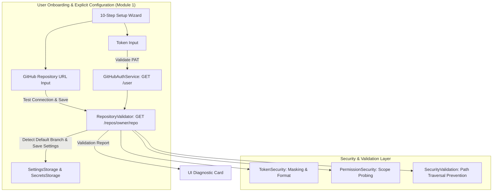

# LeetArchive 📦

**LeetArchive** is an open-source, production-quality Manifest V3 browser extension (Chrome / Edge) designed to automatically archive accepted coding solutions to GitHub following the principle of **least privilege**.

> [!IMPORTANT]
> **LeetArchive** is an independent project built with a security-first, privacy-first architecture using GitHub Fine-Grained Personal Access Tokens (PATs) scoped to **exactly one target repository**.

---

## 🔒 Security & Privacy Philosophy

LeetArchive is built around **least privilege**:

* **Fine-Grained PAT Authentication**: Never request broad account-wide OAuth permissions.
* **Single-Repository Scope**: Exactly one target repository can be configured. Future sync operations target only that repository.
* **No Unnecessary Scopes**: Requires only `Contents → Read & Write` and `Metadata → Read`.
* **Zero Credential Exposure**: Tokens are stored safely in browser local storage (`chrome.storage.local`), masked in UI views, and never logged or sent to external servers.

---

## 🔑 Module 1 — First-Time Setup Wizard

LeetArchive includes an onboarding wizard inside the options page to guide you through creating a Fine-Grained PAT:

1. Open GitHub's Fine-Grained Personal Access Token creation page (opens `https://github.com/settings/tokens?type=beta`).
2. Give the token a descriptive **Token name** (for example, `LeetArchive`).
3. Under **Repository access**, select **Only select repositories**.
4. Create a dedicated repository (recommended: `leetcode-solutions`) or select an existing repository.
5. Grant access to **only that repository**.
6. Grant only the minimum required repository permissions:
   - **Contents** → `Access: Read and write`
   - **Metadata** → `Access: Read-only`
7. **Recommended:** Select **No expiration** so LeetArchive continues to function without requiring periodic token replacement.
8. If you prefer regular credential rotation or are subject to organizational security policies, you may instead choose an expiration date and simply replace the token in LeetArchive when it expires.
9. Click **Generate token** at the bottom of the page.
10. Copy the generated token (starts with `github_pat_...`), paste it into Section 1, and enter your **GitHub Repository URL** (e.g. `https://github.com/username/reponame` or `username/reponame`) in Section 2.

### 🛡️ Why These Recommendations Exist

* **Only one repository** → Strictly follows the principle of *least privilege* so LeetArchive cannot modify or access any other repositories in your GitHub account.
* **Minimum permissions only** → Restricts token capabilities to only writing solution files and reading repository metadata, minimizing security risks.
* **No expiration (recommended option)** → Avoids unexpected workflow interruptions for personal archiving projects. Expiration is never strictly forced—you remain free to choose a custom expiration date if desired.

---

## 🏛️ Project Architecture



---

## 📁 Directory Responsibilities

```text
leetarchive/
├── public/
│   ├── manifest.json           # Manifest V3 extension configuration
│   └── assets/icons/           # Extension icons (16x16, 48x48, 128x128)
│
├── src/
│   ├── core/                   # Global configuration & event bus
│   │   ├── config.ts           # App constants & GitHub PAT creation URL
│   │   ├── events.ts           # Extension EventBus
│   │   └── permissions.ts      # Permission scope definitions
│   │
│   ├── security/               # Security layer
│   │   ├── token.ts            # Token classification & masking
│   │   ├── permissions.ts      # Permission scope parser
│   │   └── validation.ts       # Path traversal & input sanitization
│   │
│   ├── storage/                # Separated storage
│   │   ├── settings.ts         # User preferences (target repo, branch)
│   │   ├── cache.ts            # Solution sync logs
│   │   └── secrets.ts          # Secure token credential storage
│   │
│   ├── github/                 # GitHub REST API services
│   │   ├── api.ts              # Low-level fetchApi client
│   │   ├── auth.ts             # Token validation (GET /user)
│   │   ├── repository.ts       # Repository REST service
│   │   ├── contents.ts         # Git Contents API operations
│   │   ├── commits.ts          # Git Trees & Commit API operations
│   │   └── repository-validator.ts # Live scope & write capability validator
│   │
│   ├── options/                # First-Time Setup Wizard & Settings Page
│   │   ├── options.html        # 10-step wizard, token form, explicit repo fields, report card
│   │   ├── options.ts          # Token validation, owner/repo validation, connection testing
│   │   └── options.css         # Glassmorphism dark mode UI styling
│   │
│   ├── popup/                  # Extension popup status badge & quick setup link
│   ├── types/                  # TypeScript definitions
│   └── utils/                  # Logger, slugify, and helper utilities
│
├── tests/                      # Vitest test suite
└── vite.config.ts              # Vite bundling configuration
```

---

## 🛠️ Development & Build Instructions

```bash
# Install dependencies
npm install

# Format code with Prettier
npm run format

# Run TypeScript type check
npm run type-check

# Run linter
npm run lint

# Run unit tests
npm run test

# Build production extension into dist/
npm run build
```

---

## 🔌 Loading Extension into Chrome / Edge

1. Run `npm run build`.
2. Open Chrome/Edge and navigate to `chrome://extensions` or `edge://extensions`.
3. Enable **Developer mode**.
4. Click **Load unpacked** and select the `dist/` directory.
